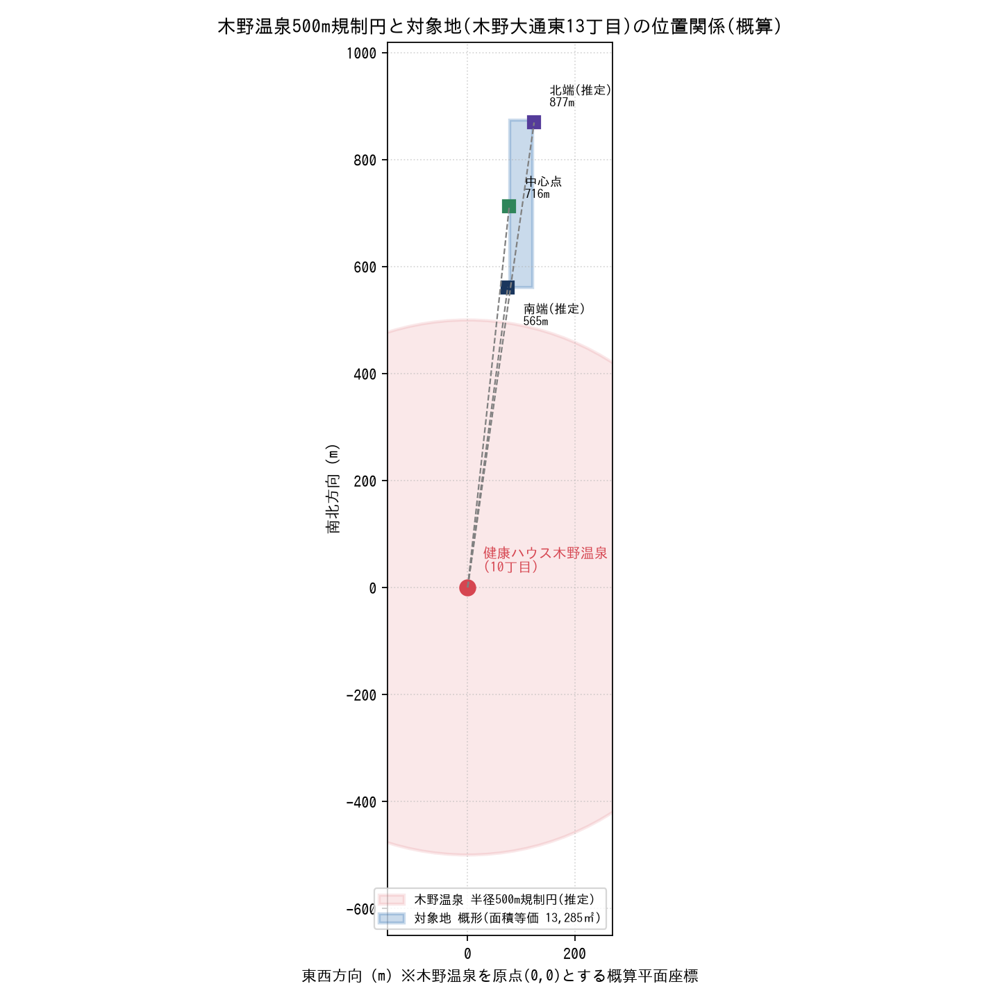

# 音更町木野 滞在型スパ開発用地 温泉掘削500m規制 検証レポート

対象地：北海道河東郡音更町木野大通東13丁目3番11、4番1（計13,285㎡）
検証日：2026年9月

---

## 0. 結論の要点(先に結論)

公開されている街区(丁目)代表点データを用いた試算では、**「健康ハウス木野温泉」(10丁目)から対象地(13丁目)までの直線距離は、敷地の最も温泉に近い「南端」推定点でも約565m、中心点で約716m、最も遠い「北端」推定点で約877mとなり、いずれも500mの規制ラインの外側**という結果になりました。

これは仮説にあった「約350〜450m」「敷地南側が500m規制円に抵触する可能性が高い」という前提とは異なる結果です。ただし、この試算は**街区(丁目)単位の代表点座標**を用いたものであり、以下の限界がある点を必ず確認してください（詳細は1章）。

- 温泉施設の建物そのものの座標ではなく、10丁目という区画全体の代表点
- 対象地も13丁目という区画全体の代表点＋隣接丁目からの補間値であり、3番11・4番1の実際の筆界(登記上の境界線)座標ではない
- 「原則半径500m」という数値も北海道温泉保護対策要綱の一般的な運用に基づく前提であり、実際の適用半径・起点(源泉の湧出地点か建物か等)は十勝総合振興局への確認が必須

→ **仮説通り「敷地の一部が500m圏内、北側だけが圏外」という際どいライン取りである可能性は、この試算からは支持されません。** むしろ全域が圏外に近い可能性が高いという結果ですが、これは朗報である一方、公式判断のズレを生まないよう、2章の実測データ取得を先行させることを強く推奨します。

---

## 1. 実測座標に基づく直線距離の算出

### 1.1 データソースと精度の限界

丁目単位の正確な緯度経度（地番単位ではなく街区代表点）は、国土交通省「位置参照情報」を原典とする [Geolonia 住所データ](https://github.com/geolonia/japanese-addresses)（CC BY 4.0）から取得しました。この環境からは以下の理由により、より高精度な情報源に直接アクセスできませんでした。

| 試行した情報源 | 結果 |
|---|---|
| 国土地理院 地図・位置参照(住所検索API) | ネットワークポリシーによりアクセス不可 |
| Nominatim(OpenStreetMap) ジオコーディング | ネットワークポリシーによりアクセス不可 |
| Googleマップ | ネットワークポリシーによりアクセス不可 |
| Geolonia住所データ(GitHub, 街区/丁目代表点) | **取得成功**（本レポートの基礎データ） |

Geoloniaデータは「丁目」単位（例：木野大通東十丁目、十三丁目）の代表点であり、**個別の地番(6番地1、3番11等)の実際の建物・筆界座標ではありません。** そのため、以下の算出値は「概算・スクリーニング用」の精度であり、最終的な行政協議・掘削申請には十勝総合振興局または音更町のGIS/公図データ、または土地家屋調査士による実測座標の取得を必須としてください（4章参照）。

### 1.2 使用した基準点

| 地点 | 緯度 | 経度 | 取得方法 |
|---|---|---|---|
| 健康ハウス木野温泉(10丁目6-1) | 42.954908 | 143.208316 | 木野大通東十丁目 代表点 |
| 対象地 中心点(13丁目) | 42.961309 | 143.209271 | 木野大通東十三丁目 代表点 |
| 対象地 南端(推定) | 42.959948 | 143.209236 | 12丁目・13丁目代表点の中点で補間 |
| 対象地 北端(推定) | 42.962716 | 143.209841 | 13丁目・14丁目代表点の中点で補間 |
| 天然温泉 鳳乃舞 音更(17丁目) | 42.970846 | 143.202172 | 木野西通十七丁目 代表点 |

南端・北端は、対象地が含まれる13丁目の代表点だけでは「敷地内のどこが北端／南端か」がわからないため、**隣接する12丁目・14丁目の代表点との中点を、街区境界の目安として補間**しました。検算として12丁目↔13丁目、13丁目↔14丁目の代表点間距離を計算したところ、それぞれ302.6m、326.2mとなり、この地区の1丁目あたりの街区スパン(約300〜330m)として矛盾のない値でした。

### 1.3 算出結果(Haversine公式による直線距離)

| 起点 | 対象地 南端(推定) | 対象地 中心点 | 対象地 北端(推定) |
|---|---:|---:|---:|
| 健康ハウス木野温泉 | **565.5 m** | 716.0 m | 877.0 m |
| 鳳乃舞 音更(参考) | 1,341.1 m | 1,207.6 m | 1,098.5 m |

計算スクリプト：[`distance_calc.py`](./distance_calc.py)、生データ：[`results.json`](./results.json)

**重要な留意点：** 上表の「南端」は敷地の最北端・最南端そのものではなく、13丁目という街区の南側境界目安です。対象地(3番11・4番1)がこの13丁目街区のどの位置を占めているか（街区全体を占有しているか、街区の一部か）によって、実際の最短距離はこれより短くなる可能性があります。**特に、この計算結果(565m)と当初仮説(350〜450m)の差は約120〜200mあり、無視できません。** この乖離の原因として考えられるのは、①丁目代表点が実際の建物・筆界より内側/外側にずれている、②木野温泉側の実際の湯口・源泉位置が建物より道路側/奥まった位置にある、③当初仮説の距離感がロードマップ上の目視・道なり距離を基にしていた、等が考えられます。**この乖離自体が、次章の実測確認の必要性を裏付けています。**

---

## 2. 500m規制円と敷地形状の位置関係図

3種類の形式で出力しました。対象地の敷地形状は公図データを取得できなかったため、**「面積等価(13,285㎡)・南北推定端点基準の概形矩形」**として描画しています(南北奥行き 約312m×東西間口 約43mの帯状モデル)。実際の筆界形状（間口・奥行きの比率）とは異なる可能性が高いため、位置関係の傾向を掴むための模式図としてご利用ください。

### 2.1 静止画(PNG)

生成スクリプト：[`generate_maps.py`](./generate_maps.py)（matplotlib使用）

### 2.2 インタラクティブ地図(folium/HTML)

ブラウザで開くと、OpenStreetMap上に木野温泉・鳳乃舞・対象地(南端/中心/北端)・500m円をプロットしたインタラクティブ地図が表示されます。

ファイル：[`map_interactive.html`](./map_interactive.html)（同スクリプトで生成、foliumはOpenStreetMapタイルを使用）

### 2.3 単体表示用SVG

ライブラリ不要でブラウザに直接ドラッグ＆ドロップして開けるスタンドアロンSVGです。

ファイル：[`svg_diagram.svg`](./svg_diagram.svg)（生成スクリプト：[`generate_svg.py`](./generate_svg.py)）

### 2.4 図の読み方

- 赤の破線円：健康ハウス木野温泉を中心とした半径500m(北海道温泉保護対策要綱の一般的な離隔距離の推定値)
- 青の帯：対象地の概形(面積等価モデル)
- 図が示す通り、この試算では**対象地の南端相当点でも規制円の外側**にプロットされています

---

## 3. 十勝総合振興局・温泉掘削業者との協議用 論点整理

上記の距離試算はあくまで公開データによるスクリーニングであり、行政協議・実際の掘削可否判断の根拠にはできません。振興局(環境生活課)およびボーリング業者との協議では、以下の技術的・法的チェックポイントを明確にすることを推奨します。

### 3.1 規制の根拠・運用そのものを確認する

1. **要綱の正式名称・最新版の確認**：「北海道温泉保護対策要綱」の現行版の入手（改正の有無、離隔距離の原則値が本当に「500m」か、地域や源泉の湧出量・温度によって基準が変動しないか）。
2. **離隔距離500mが「原則」である場合の例外規定**：要綱上、原則500m以内でも、水理地質調査（揚湯試験・水位観測等）の結果次第で許可される運用があるか。北海道内の他自治体・事業者の許可実績（例外許可の前例）があれば確認する。
3. **距離の起点・終点の定義**：
   - 起点：既存源泉の「井戸(掘削)位置」か、それとも湯口・建物・敷地境界か。
   - 終点：新規掘削の「計画井戸位置」であって、敷地境界ではないはず（つまり敷地の一部が500m圏内でも、掘削井戸自体を圏外に配置すれば良い、という解釈で正しいか）。
   - → 本レポートの「敷地北端で掘削する」戦略が有効かどうかは、この定義の確認が前提条件になります。
4. **測定方法の公的基準**：水平距離(直線距離)で測るのか、道路距離や高低差を考慮するのか。使用する測地系(世界測地系/日本測地系)や地図・座標系の指定があるか。

### 3.2 座標・実測データの確定(最優先事項)

5. **公図・地籍座標の取得**：音更町(建設水道部・税務課)から、3番11・4番1の公図及び地積測量図(座標値付きのものがあれば理想)を取得し、筆界の正確な緯度経度を確定する。
6. **既存源泉(健康ハウス木野温泉)の掘削位置(井戸位置)の特定**：温泉法に基づく「温泉利用許可申請書」等の公開情報、または北海道(十勝総合振興局)が保有する温泉台帳から、実際の掘削地点座標を確認する（建物所在地の代表点ではなく、井戸そのものの位置）。
7. **上記2点をもとにした土地家屋調査士等による実測・作図**：本レポートの試算(丁目代表点ベース)と実測値の乖離(1章で示した約120、200mのズレの可能性)を解消するため、確定測量座標での再算出を行う。
8. **鳳乃舞 音更など他の既存源泉の有無の網羅確認**：木野温泉以外にも半径500m圏に温泉井戸がないか、振興局の温泉台帳で周辺一帯を確認する（今回の試算では鳳乃舞は約1.1〜1.3kmで問題ないが、未把握の井戸がある可能性を排除する）。

### 3.3 掘削計画・技術面での確認事項

9. **掘削位置と揚湯試験の設計**：敷地北端で掘削する場合の井戸位置候補を複数(2〜3案)用意し、それぞれが500m規制円の外側にあることを座標で明示した申請図面を準備する。
10. **既存源泉への影響評価(水理地質調査)の要否**：500m圏外であっても、近接性から水量・水位への影響評価(揚湯試験、周辺源泉のモニタリング)を求められる可能性があるか確認する。
11. **引湯配管の距離・法規制**：北端で掘削した源泉を敷地内配管で南側の温浴棟まで引湯する構想について、
    - 温泉法上、引湯管路の長さ・保温・温度低下に関する技術基準の有無
    - 音更町の宅地造成・開発行為許可における配管埋設(道路占用・自敷地内埋設)の扱い
    - 分割貸地(残地の店舗区画)を配管が横断する場合の地役権設定の要否
12. **掘削深度・地質リスク**：計画地が「旧河川敷地」「原野」との記載があり、地盤・砂礫層の状況によっては掘削深度やケーシング工法、蛇篭撤去等の造成費用に影響する可能性があるため、ボーリング業者に近隣既存源泉の井戸台帳(深度・湧出温度・成分)を踏まえた事前見積りを依頼する。

### 3.4 スケジュール・許認可プロセス

13. **温泉法に基づく掘削許可の標準処理期間**：申請から許可までの標準処理期間、現地調査の有無、周辺源泉権利者への意見照会(温泉法第4条の利害関係者協議)の有無とその期間。
14. **既存源泉権利者(木野温泉)との事前協議の要否**：制度上必須でなくても、500m近接案件は近隣源泉所有者への事前説明が许可審査上重要視されるケースがあるため、任意協議の要否を振興局に確認する。

---

## 4. 次のアクション(推奨)

1. **[最優先]** 音更町から3番11・4番1の公図・地積測量図(座標付き)を取得する。
2. 十勝総合振興局(環境生活課)の温泉担当窓口へ事前相談し、木野温泉の実際の掘削位置座標、および3.1節の運用ルール(起点定義・測定方法・例外規定)を確認する。
3. 上記2つの実測データが揃い次第、本レポートと同じ手法(`distance_calc.py`・`generate_maps.py`)で再計算し、確定版の位置関係図を作成する(スクリプトは座標を差し替えるだけで再利用可能)。
4. 温泉ボーリング業者に一次相談し、敷地北端候補地点での掘削可能性(地質・深度・概算コスト)の感触を得る。

---

## 付属ファイル一覧

| ファイル | 内容 |
|---|---|
| `distance_calc.py` | 距離計算スクリプト(Haversine公式) |
| `results.json` | 距離計算の生データ(JSON) |
| `generate_maps.py` | folium(インタラクティブ地図)・matplotlib(静止画)生成スクリプト |
| `generate_svg.py` | 単体表示用SVG生成スクリプト |
| `map_interactive.html` | インタラクティブ地図(ブラウザで開く) |
| `map_static.png` | 位置関係図(静止画) |
| `svg_diagram.svg` | 単体表示用SVG図面 |
